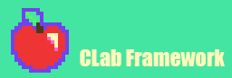

# CLab-Framework
  
A SDL2 and C++ framework to build experiments and games easily!

## Dependencies
- SDL2
- SDL2_image
- SDL2_ttf
- SDL2_mixer

## Main Application
```c++
#pragma once

#include "clf.h"

class Game : public clf::Engine {
protected:
	void OnStart() override {

	}

	void OnInput(const Uint8* keystates) override {

	}

	void OnUpdate(float deltaTime) override {

	}

	void OnRender() override {
		clf::Render::Clear(clf::Utilities::Color::PORTAFINO);
	}

	void OnFinish() override {

	}
};

int main(int argc, char* args[]) {
	Game game;
	if (!game.Build(
		"Game Title - CLab Framework",
		600,
		400,
		SDL_INIT_EVERYTHING,
		SDL_WINDOW_SHOWN,
		nullptr))
		return -1;


	return 0;
}
```

## Examples
### Snake


### Pong


### Rpg Movement

